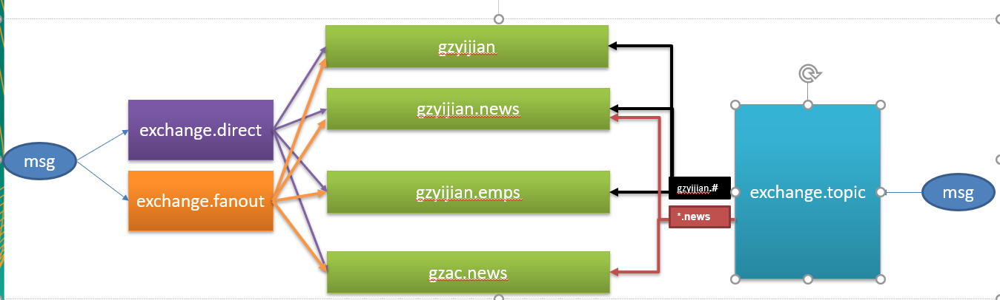

# springboot-learning

一、Spring Boot与缓存

1. 运行 redis 镜像: docker run -d -p 6379:6379 --name myredis 3c41ce05add9

2. 中文官网: http://www.redis.cn/

3. docker hub: https://hub.docker.com/

二、Spring Boot与消息

1. docker pull rabbitmq:3-management
2. docker run -d -p 5672:5672 -p 15672:15672 --name myrabbitmq 6ffc11daa8d0
3. http://192.168.74.129:15672/
4. 

三、Spring Boot与检索

四、Spring Boot与任务

五、Spring Boot与安全

六、Spring Boot与分布式

七、Spring Boot与监控管理

八、Spring Boot与部署
