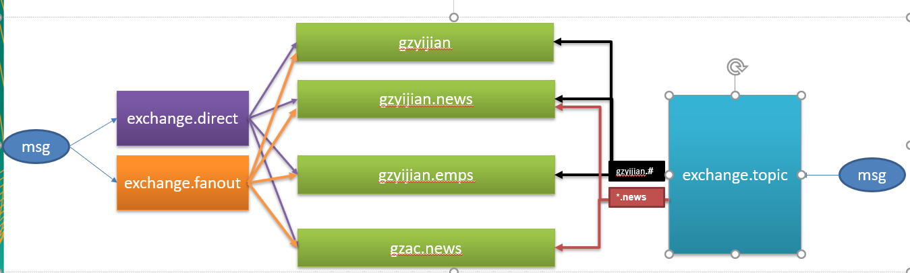
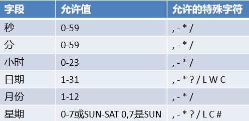
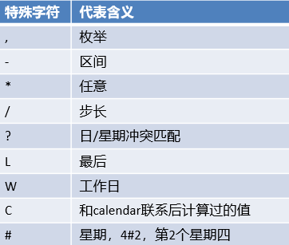

# springboot-learning

一、Spring Boot与缓存

1. 运行 redis 镜像: docker run -d -p 6379:6379 --name myredis imageId

2. 中文官网: http://www.redis.cn/

3. docker hub: https://hub.docker.com/

二、Spring Boot与消息

1. docker pull rabbitmq:3-management
2. docker run -d -p 5672:5672 -p 15672:15672 --name myrabbitmq imageId
3. http://192.168.74.129:15672/
4.  rabbitmq演示示例

三、Spring Boot与检索

1. docker pull elasticsearch:7.1.1  

   docker pull elasticsearch:6.8.0

   docker pull elasticsearch:5.6.16

   docker pull elasticsearch:2.4.6

2. docker run -e ES_JAVA_OPTS="-Xms256m -Xmx256m" -d -p 9200:9200 -p 9300:9300 --name myelasticsearch imageId

   9200: web 通信(Http协议, 主要用于外部通讯); 9300: 各个节点通信(Tcp协议，jar之间就是通过tcp协议通讯)

3. 192.168.74.129:9200

4. Elasticsearch: 权威指南: https://www.elastic.co/guide/cn/elasticsearch/guide/current/index.html

   调用示例: http://192.168.74.129:9200//megacorp/employee/1
   
   error: Fielddata is disabled on text fields by default. https://blog.csdn.net/u011403655/article/details/71107415
   
   ```json
   // PUT megacorp/_mapping/employee/
   {
       "properties": {
           "interests": {
               "type": "text",
               "fielddata": true
           }
       }
   }
   ```
   
5. jest

   ​	error:Illegal character in scheme name at index 0 ->uris加上 http://

四、Spring Boot与任务

1. cron 表达式

   

   

   

五、Spring Boot与安全

1. thymeleaf 2.0->3.0 升级 https://www.cnblogs.com/aibabel/p/6963534.html
2.  springsecurity 配置参考: https://docs.spring.io/spring-security/site/docs/current/guides/html5/helloworld-boot.html
3.  thymeleaf 模板引擎对 springsecurity 支持:  https://docs.spring.io/spring-security/site/docs/current/guides/html5/helloworld-boot.html

六、Spring Boot与分布式

1. docker pull zookeeper
2. docker run --name myzookeeper -p 2181:2181 --restart always -d ImageId
3. 升级springboot 到 2.0 服务注册不上去？

七、Spring Boot与监控管理

八、Spring Boot与部署